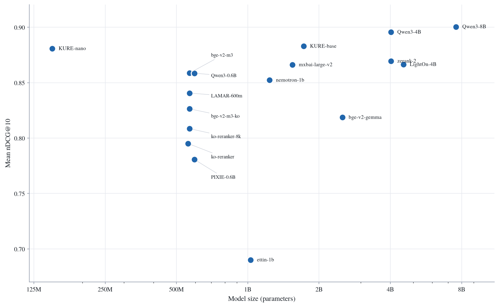

# Make Reranker Benchmark Simple Again
## Purpose
* 본 프로젝트는 Reranker Benchmark Evaluation을 최소한의 의존성으로 경량화하여, 누구나 쉽게 실행하고 즉각적인 결과를 얻을 수 있도록 설계되었습니다.

## Plan
* 본 프로젝트에서는 BM25 기반의 Stage 1 Retrieval을 통해 각 벤치마크 query 당 retrieval corpus를 1000개로 제한합니다. 각 query에 대한 정답 문서 정보를 포함하여, BM25 기준 상위 1000개 문서의 ID를 저장합니다.
* 이후 각 query 당 Top-k 50개의 corpus id를 활용하여, Stage 2 Reranking을 진행합니다.

## Stage 1 Retrieval
BM25 기반 Stage 1 검색(토크나이저별 비교, 실행 코드, 결과)은 [`eval/results/stage1/README.md`](eval/results/stage1/README.md)에 정리되어 있습니다. Stage 2 는 여기서 가장 높은 성능을 보인 **Mecab** tokenizer 의 BM25 결과를 1차 후보로 사용합니다.

## Stage 2 Reranking
### Benchmark Datasets
**공식 [MTEB(kor, v2)](https://github.com/embeddings-benchmark/mteb) 의 9개 Korean Retrieval 벤치마크** (총 12,054 queries)에 대한 평가를 진행하였습니다. 각 task 는 MTEB 표준 `eval_splits` 를 그대로 사용합니다 (예: MLDR = dev+test 평균, MIRACL/Ko-StrategyQA = dev, 그 외 = test).

| 데이터셋 | 설명 | split | queries |
|---|---|---|---|
| [Ko-StrategyQA](https://huggingface.co/datasets/taeminlee/Ko-StrategyQA) | 한국어 ODQA multi-hop 검색 (StrategyQA 번역) | dev | 592 |
| [AutoRAGRetrieval](https://huggingface.co/datasets/yjoonjang/markers_bm) | 금융·공공·의료·법률·커머스 5개 분야 문서 검색 | test | 114 |
| [MIRACLRetrieval](https://huggingface.co/datasets/miracl/miracl) | Wikipedia 기반 한국어 문서 검색 | dev | 213 |
| [PublicHealthQA](https://huggingface.co/datasets/xhluca/publichealth-qa) | 의료·공중보건 도메인 문서 검색 | test | 77 |
| [BelebeleRetrieval](https://huggingface.co/datasets/facebook/belebele) | FLORES-200 기반 한국어 문서 검색 (kor subset) | test | 900 |
| [MrTidyRetrieval](https://huggingface.co/datasets/mteb/mrtidy) | Wikipedia 기반 한국어 문서 검색 | test | 421 |
| [SQuADKorV1Retrieval](https://huggingface.co/datasets/yjoonjang/squad_kor_v1) | 한국어 SQuAD v1.0 기반 검색 | test | 5,774 |
| [LawIRKo](https://huggingface.co/datasets/on-and-on/lawgov_ir-ko) | 한국어 법률 정보 검색 | test | 3,563 |
| [MultiLongDocRetrieval](https://huggingface.co/datasets/Shitao/MLDR) | 다양한 도메인 한국어 **장문** 검색 | dev+test | 400 |
> **Note**: 기존 XPQARetrieval·WebFAQRetrieval 은 공식 MTEB(kor, v2) subset 이 아니므로 제외합니다.

### Evaluation Method
- **Gold-injected reranking**: 각 query 의 **정답(gold) 문서를 재랭킹 후보 집합에 항상 포함**시킨 뒤 (후보 = BM25 top-50 ∪ gold) reranker 로 재랭킹합니다. BM25 가 정답을 top-50 안에 놓치더라도 reranker 의 순수 랭킹 품질을 측정하기 위함입니다.
- **Max sequence length**: **모든 모델을 `max_length=8192` 로 측정**합니다. 단, **아키텍처상 8192 를 지원하지 않는 모델은 네이티브 최대 길이로 측정**합니다. 각 결과 파일(`eval/results/stage2/<model>/<task>.json`)에 실제 적용된 `_max_length` 가 기록됩니다.
	- `Dongjin-kr/ko-reranker` = 512
	- `cross-encoder/ettin-reranker-1b-v1` = 7999
- **Pairs Per Second (PPS)**: [Ettin-Reranker 블로그](https://huggingface.co/blog/ettin-reranker)를 참고하여, batch size 를 8 부터 2배씩 첫 OOM 까지 늘리며, 각 batch size 에서 샘플을 그 배수로 반복·길이 내림차순 정렬한 뒤 warmup 1회 + 3회 반복합니다. 모델 forward 호출만 CUDA event 로 재므로 토크나이즈·데이터 로딩은 제외되며, PPS = 처리 쌍 수 / forward 시간 합, 가장 빠른 batch size 의 값을 기록합니다 (`pps`, `pps_batch_size`, `pps_sweep`).

### Evaluation Code
```bash
# NDCG + 추론 처리량(PPS)을 한 번에 — 한 번 로드한 모델을 bf16 + flash_attention_2 로 전환해 둘 다 측정.
uv run python eval/evaluate_reranker.py \
	--model_names BAAI/bge-reranker-v2-m3 \
	--gpu_id 0 \
	--batch_size 8 \
	--speed

# 또는 특정 데이터셋만 선택
uv run python eval/evaluate_reranker.py \
	--model_names "my_reranker_model" \
	--tasks Ko-StrategyQA AutoRAGRetrieval SQuADKorV1Retrieval LawIRKo \
	--gpu_id 0 \
	--batch_size 8 \
	--speed
```

### Leaderboard
```bash
cd eval
uv run streamlit run leaderboard_reranker.py
```

**모델 크기 vs. 성능 (9-subset)** — x축: 파라미터 수(log), y축: 9-subset mean NDCG@10. jina-reranker-v3/v3.5 는 제외.



### Results — Official kMTEB (9 subsets)
<!-- **공식 9개 subset 을 모두 평가한 모델**의 9-subset mean NDCG@10, PPS -->
| Model | Params | Mean NDCG@10 | 8-task PPS | MLDR PPS |
|---|---|---|---|---|
| tomaarsen/Qwen3-Reranker-8B-seq-cls | 7.6B | 0.9004 | 16.9 | 0.7 |
| tomaarsen/Qwen3-Reranker-4B-seq-cls | 4.0B | 0.8956 | 27.2 | 1.1 |
| nlpai-lab/KURE-Reranker-base | 1.7B | 0.8828 | 60.5 | 2.6 |
| nlpai-lab/KURE-Reranker-nano | 149M | 0.8808 | 530.9 | 16.5 |
| zeroentropy/zerank-2-reranker | 4.0B | 0.8695 | 33.0 | 1.1 |
| lightonai/LightOn-rerank-PW-4B | 4.5B | 0.8664 | 16.8 | 0.7 |
| mixedbread-ai/mxbai-rerank-large-v2 | 1.5B | 0.8661 | 72.9 | 3.2 |
| BAAI/bge-reranker-v2-m3 | 568M | 0.8586 | 453.5 | 9.3 |
| tomaarsen/Qwen3-Reranker-0.6B-seq-cls | 596M | 0.8585 | 111.5 | 4.2 |
| nvidia/llama-nemotron-rerank-1b-v2 | 1.2B | 0.8522 | 142.7 | 3.9 |
| nlpai-lab/LAMAR-600m | 568M | 0.8406 | 458.8 | 9.2 |
| dragonkue/bge-reranker-v2-m3-ko | 568M | 0.8263 | 450.6 | 9.2 |
| BAAI/bge-reranker-v2-gemma | 2.5B | 0.8186 | 65.7 | 2.5 |
| upskyy/ko-reranker-8k | 568M | 0.8085 | 453.3 | 9.2 |
| Dongjin-kr/ko-reranker | 560M | 0.7950 | 509.0 | 272.7 |
| telepix/PIXIE-Spell-Reranker-Preview-0.6B | 596M | 0.7806 | 111.6 | 4.3 |
| cross-encoder/ettin-reranker-1b-v1 | 1.0B | 0.6901 | 55.5 | 3.8 |

**8-task PPS** = 추론 처리량(query–document pairs/s), MLDR 제외 8 subset 평균. RTX A6000 1장, bf16 + flash_attention_2. **MLDR PPS** = 장문 MultiLongDocRetrieval 의 처리량.

> `jinaai/jina-reranker-v3` 와 `jinaai/jina-reranker-v3.5` 는 **listwise** reranker 로, 장문(`MultiLongDocRetrieval`)에서 다른 모델과 동일 조건(8192)으로 공정 비교가 불가능하여 두 모델 모두 MLDR 을 N/A 로 두고 위 9-subset 평가에서 제외합니다. 

### Per-dataset NDCG@10

| Model | Params | Ko-StrategyQA | AutoRAGRetrieval | PublicHealthQA | BelebeleRetrieval | MIRACLRetrieval | MrTidyRetrieval | MultiLongDocRetrieval | SQuADKorV1Retrieval | LawIRKo |
|---|---|---|---|---|---|---|---|---|---|---|
| tomaarsen/Qwen3-Reranker-8B-seq-cls | 7.6B | 0.8679 | 0.9546 | 0.8893 | 0.9907 | 0.8490 | 0.8409 | 0.8220 | 0.9880 | 0.9014 |
| tomaarsen/Qwen3-Reranker-4B-seq-cls | 4.0B | 0.8733 | 0.9707 | 0.8685 | 0.9906 | 0.8533 | 0.8321 | 0.8105 | 0.9861 | 0.8752 |
| nlpai-lab/KURE-Reranker-base | 1.7B | 0.8525 | 0.9762 | 0.8722 | 0.9881 | 0.8323 | 0.7978 | 0.8031 | 0.9883 | 0.8350 |
| nlpai-lab/KURE-Reranker-nano | 149M | 0.8582 | 0.9741 | 0.8475 | 0.9830 | 0.8400 | 0.8011 | 0.7966 | 0.9895 | 0.8368 |
| jinaai/jina-reranker-v3.5 | 597M | 0.8539 | 0.9838 | 0.8094 | 0.9733 | 0.8565 | 0.8194 | — | 0.9887 | 0.8545 |
| jinaai/jina-reranker-v3 | 597M | 0.8553 | 0.9773 | 0.7960 | 0.9695 | 0.8449 | 0.8104 | — | 0.9859 | 0.8546 |
| zeroentropy/zerank-2-reranker | 4.0B | 0.8712 | 0.9436 | 0.8646 | 0.9846 | 0.8003 | 0.8027 | 0.7120 | 0.9791 | 0.8669 |
| lightonai/LightOn-rerank-PW-4B | 4.5B | 0.8567 | 0.9321 | 0.8693 | 0.9882 | 0.8072 | 0.8091 | 0.7609 | 0.9803 | 0.7938 |
| mixedbread-ai/mxbai-rerank-large-v2 | 1.5B | 0.8563 | 0.9531 | 0.8772 | 0.9778 | 0.7939 | 0.8771 | 0.6787 | 0.9681 | 0.8130 |
| BAAI/bge-reranker-v2-m3 | 568M | 0.8487 | 0.9663 | 0.8475 | 0.9853 | 0.8129 | 0.8222 | 0.6690 | 0.9853 | 0.7906 |
| tomaarsen/Qwen3-Reranker-0.6B-seq-cls | 596M | 0.8336 | 0.9308 | 0.8489 | 0.9779 | 0.8507 | 0.7359 | 0.7813 | 0.9808 | 0.7867 |
| nvidia/llama-nemotron-rerank-1b-v2 | 1.2B | 0.8536 | 0.9480 | 0.8491 | 0.9883 | 0.8182 | 0.8026 | 0.6719 | 0.9858 | 0.7527 |
| nlpai-lab/LAMAR-600m | 568M | 0.8461 | 0.9591 | 0.8225 | 0.9835 | 0.8214 | 0.7975 | 0.5679 | 0.9850 | 0.7822 |
| dragonkue/bge-reranker-v2-m3-ko | 568M | 0.8232 | 0.9684 | 0.8708 | 0.9769 | 0.7573 | 0.6776 | 0.7061 | 0.9846 | 0.6721 |
| BAAI/bge-reranker-v2-gemma | 2.5B | 0.8614 | 0.9407 | 0.8698 | 0.9857 | 0.8362 | 0.8429 | 0.2881 | 0.9858 | 0.7572 |
| upskyy/ko-reranker-8k | 568M | 0.8143 | 0.9230 | 0.8388 | 0.9291 | 0.7249 | 0.6998 | 0.5975 | 0.9718 | 0.7770 |
| Dongjin-kr/ko-reranker | 560M | 0.8468 | 0.9014 | 0.7675 | 0.9759 | 0.8017 | 0.7772 | 0.3721 | 0.9785 | 0.7343 |
| telepix/PIXIE-Spell-Reranker-Preview-0.6B | 596M | 0.8329 | 0.9794 | 0.8534 | 0.9777 | 0.8449 | 0.7650 | 0.1829 | 0.9850 | 0.6042 |
| cross-encoder/ettin-reranker-1b-v1 | 1.0B | 0.6624 | 0.8901 | 0.7461 | 0.6914 | 0.7004 | 0.6659 | 0.3651 | 0.9590 | 0.5306 |

## Citation

본 벤치마크를 연구에 활용하셨다면 아래와 같이 인용해 주세요.

```bibtex
@misc{reranker-simple-benchmark,
  title        = {Make Reranker Benchmark Simple Again},
  author       = {Sigrid Jin, Youngjoon Jang, Yongbin Choi, Daegon Yu, Kanghyeun Lee, Juna Jung, Junu Moon},
  year         = {2025},
  publisher    = {GitHub},
  journal      = {GitHub repository},
  howpublished = {\url{https://github.com/instructkr/reranker-simple-benchmark}}
}
```
